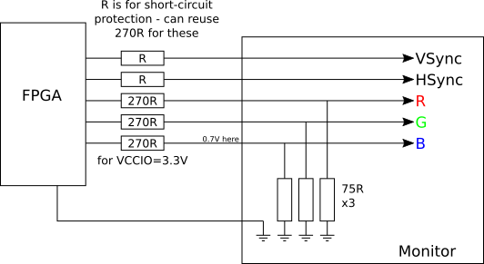
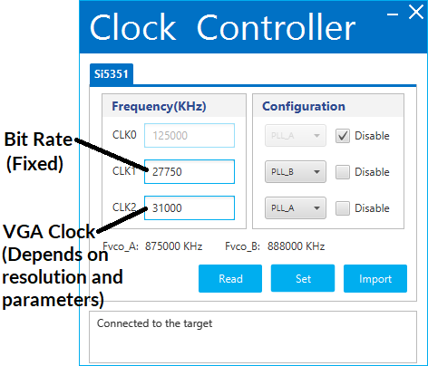

# vhdl-teletext

A teletext decoder and display generator in VHDL for FPGAs.

* Level 1.0 decoding and display
* No vendor-specific code (except dual port RAM)
* Multiple screen resolutions supported
* Small logic size
* Vunit for unit tests (testbenches only completed for some modules so far)

# RTL block diagram

# Implementation

The design has been tested on the Cyclone 10 LP Evaluation Kit. The only active external component required is a high-speed comparator for data acquisition.

Two oscillators are required, one at 27.750 MHz for teletext decoding and one at whatever frequency is required for the VGA resolution in use (the same 27.750 MHz oscillator is acceptable when using 720x576). The programmable oscillator can be programmed to provide these on the Cyclone 10 LP Evaluation Kit but note that the settings need to be re-entered upon every power cycle.

