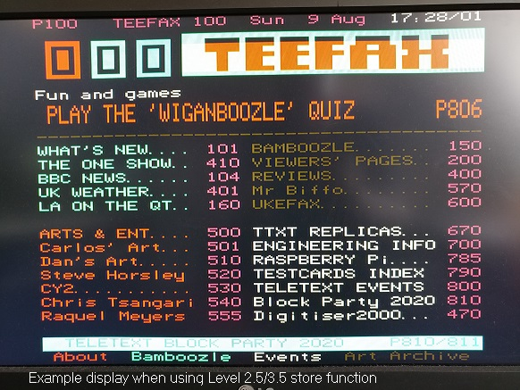
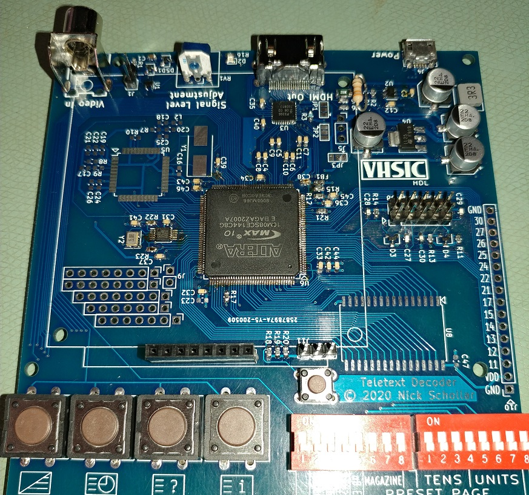
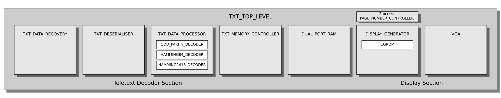

# vhdl-teletext

A teletext decoder and display generator in VHDL for FPGAs.

Detailed descriptions of how the various modules work can be found on my blog - [Nick's Electronics Blog](https://nick-elec.blogspot.com/).

* [HDMI output](https://nick-elec.blogspot.com/2020/12/generate-hdmi-dvi-using-fpga.html)
* Level 1.0 decoding and display
* Selected Level 2.5 and Level 3.5 display features implemented - CLUTs, default row and screen colour, black background substitution
* Resolution selection via DIP switches: 720x576 or 800x600 at 50Hz or 60Hz (640x480 possible with minor code modifications)
* High resolution 1280x720 mode also available - see feature/720p branch
* Alpha Black enable switch for selecting between adherence to the original specification or compatibility with certain modern teletext services
* Power-on page number selection via DIP switches
* Mix function enables/disables the display of background colours (note that this board does not display the video portion of the composite video signal over HDMI)
* Subpage selection
* Reveal button displays and hides "concealed" page content
* Page selection via number keys, up/down buttons, and Fastext keys
* Level 2.5/3.5 store function for applying enhancements to Level 1.0 pages
* NEW! Level 1 National option subsets implemented (foreign/accented characters) for English, German, Italian, French, Portuguese/Spanish, Czech/Slovak
* Parameterised design enables design tweaks without any programming knowledge
* No vendor-specific code (except dual port RAM, PLL and high-speed I/O buffers)
* [Vunit](https://vunit.github.io/) for unit tests (testbenches only completed for some modules so far)

# Hardware

The design runs on the FPGA Teletext board. The PCB includes all the hardware needed to control the teletext decoder and transmit the graphics to the display: FPGA, power supply, programmable oscillator, high-speed comparator, LVDS to TMDS level shifter, keypad, and DIP switches. More details of the board are in the Tindie listing (link below). The design could of course work on other FPGA boards if the necessary hardware is added.

The FPGA Teletext board includes spare GPIO broken out to headers, expanding the uses of the board to many more uses! One such use (if you develop the necessary firmware) could be a Telesoftware interface for vintage microcomputers.

I have assembled a small number of boards by hand and they are up for sale below. If there is serious demand for this PCB, then I will consider getting a proper production run done, and I'll offer a self-assembly kit too. Please reach out to me on [my blog](https://nick-elec.blogspot.com/2020/12/generate-hdmi-dvi-using-fpga.html) if this is of interest.

[Click here to buy the VHDL Teletext PCB on Tindie (fully assembled)](https://www.tindie.com/products/nickelec/fpga-teletext-decoder/) - ships from the UK (though all pricing is in USD on Tindie) - please remember that this is a very low volume product so I cannot achieve the low pricing of high-volume consumer gear. 

Two oscillators are required for the design: one at 27.750 MHz for teletext decoding and one at whatever frequency is required for the HDMI resolution selected using the DIP switches. The FPGA internal oscillator is used to clock the programmable oscillator controller, required because the programmable oscillator does not generate useful clock frequencies until programmed.

The leftmost DIP switch operates the enhancement data hold function and should normally be left in the up position. When in the up position, enhancement data will be treated as normal. When in the down position, enhancement data will be retained when switching to a different page without enhancement data, allowing enhancements (such as Level 2.5/3.5 colour mapping) to be used on pages that do not originally have these enhancements.

# SignalTap

The [SignalTap II Logic Analyzer](https://www.intel.com/content/dam/www/programmable/us/en/pdfs/literature/ug/ug-qpp-debug.pdf#page=21) enables you to monitor signals inside the FPGA and see the waveforms on your computer screen. This is a great tool for learning how the decoder processes real data or to help with debugging your own customisations such as a Telesoftware interface.

# RTL block diagram

# Programming the FPGA

The MAX10 FPGA is a normal SRAM-based FPGA with an internal configuration flash. Like other Altera FPGAs, it is possible to just program the SRAM without programming the flash, ideal for rapid testing of design modifications, and the design stored in flash is loaded when the board is power-cycled.

## Using a USB-Blaster

To program the FPGA, connect the programmer to J8. Load the POF file (if programming the flash) or SOF file (if only programming the SRAM) into the Quartus Programmer window, tick Program/Configure and Verify, then press Start. Programming the flash will take several seconds but programming the SRAM is instant.

It is possible to store two images in the configuration flash. When configured correctly, J11 can be used to choose which image is used.

## Using a Raspberry Pi

The FPGA can be programmed using the GPIO of a Raspberry Pi. See [https://nick-elec.blogspot.com/2020/12/program-intel-fpgas-using-raspberry-pi-openocd.html](https://nick-elec.blogspot.com/2020/12/program-intel-fpgas-using-raspberry-pi-openocd.html) for details.
