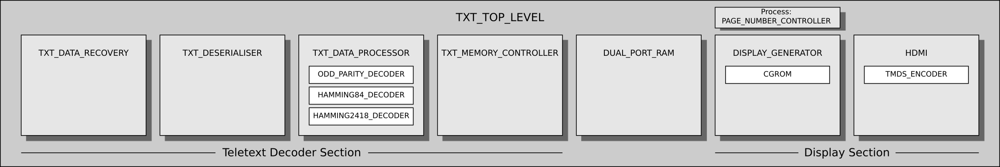
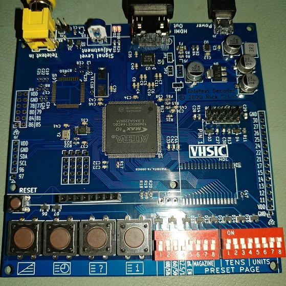

# vhdl-teletext

A teletext decoder and display generator in VHDL for FPGAs.

* Level 1.0 decoding and display
* No vendor-specific code (except dual port RAM)
* Multiple screen resolutions supported
* Small logic size
* Vunit for unit tests (testbenches only completed for some modules so far)
* HDMI output (originally VGA)

# RTL block diagram

# Implementation

The design runs on the FPGA Teletext board. The PCB includes all the hardware needed to control the teletext decoder and transmit the graphics to the display: FPGA, power supply, programmable oscillator, high-speed comparator, LVDS to TMDS level shifter, keypad, and DIP switches.

Two oscillators are required for the design: one at 27.750 MHz for teletext decoding and one at whatever frequency is required for the HDMI resolution selected using the DIP switches. The FPGA internal oscillator is used to clock the programmable oscillator controller, required because the programmable oscillator does not generate useful clock frequencies until programmed.
